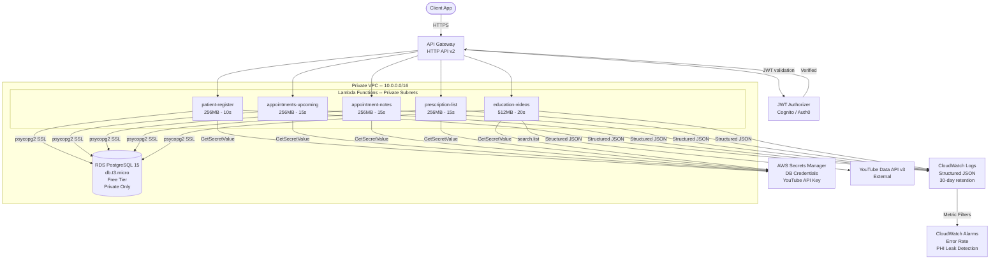
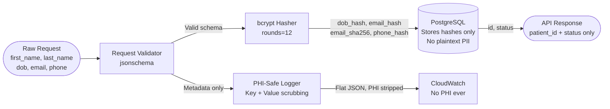

# Architecture Diagram -- Healthcare Platform

## Request Flow

## PHI Data Flow

## Security Layers

| Layer | Control |
|---|---|
| Network | RDS in private subnet -- no public access |
| Transport | SSL required on all RDS connections |
| Authentication | JWT on all routes except POST /patients/register |
| Authorisation | Per-function IAM roles -- least privilege |
| Secrets | All credentials in Secrets Manager -- never in env vars or code |
| Data at rest | RDS storage encryption enabled |
| Logging | PHI scrubbed by key name AND value pattern before CloudWatch |
| Monitoring | CloudWatch Alarms on error rate and PHI leak attempts |
